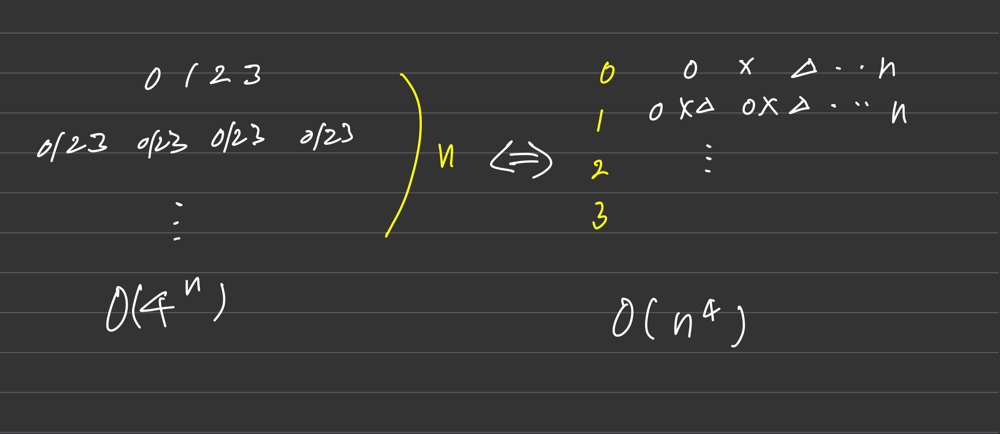

### 완전 탐색의 경우의 수를 고려하는 '상태트리'는 다음과 같이 '경우의 수 트리'와 '결정 트리' 대표적으로 두가지이다
+ 이들은 `상호 치환`이 가능한 경우가 있다

예를들어,
사용자가 누를 수 있는 `버튼` 0,1,2,3이 있다.

이 버튼을 눌러서 어떤 결과를 얻으면, 프로그램은 종료한다고 할 때 

### 왼쪽 트리( 경우의 수 트리 )
`각 레벨에서 어떤 버튼을 선택하는가`하는 기본적인 경우의 수를 표현하는 방식이다
중복 선택을 배제해야한다면, 배열 등의 형태로 `이전 레벨의 선택을 기록해서 중복 선택을 방지`해야한다
또한, 어떤 결과를 얻을 수 없는 경우, 무한 호출에 빠짐으로 `답이 없는 경우`를 고려해야 하는데

적정선을 찾기 쉽지 않다

### 오른쪽 트리( 결정 트리 ) 
`각 버튼을 누르는가 마는가?`로 관점을 바꾸어 만들어낸 트리이다 (모든 경우에 활용되는 것은 아니다)

`각 버튼을 어떻게 누르는가?`로 확장할 수도 있다 ex) check = { 0 , 1 , 1, 2 } : 누른다(1) 안 누른다(0) 두번 누른다(2)로 기록

즉 `선택하는 방법을 기준을로 세우거나 제시된 경우` 쓸 수 있다. ex) 부분 집합 : 각 원소를 선택 하거나 안하거나 2가지 방법을 가진다

특정한 환경에서 사용되는 트리이지만, `트리의 깊이가 고정`되어있기, 때문에 답이 없는 경우를 고려하기 쉽다(모든 트리 길이를 방문한 경우 종료하면 됨)

때문에, 답이 없는 경우에도 `무한 호출에 빠지지 않는다`

### 항상 상태트리의 치환 가능성을 고려하자
왼쪽 트리로 풀면 `답이 없는 경우` 외에도 여러 제약을 걸어야하는 경우가 많다. 제약 조건을 잘 못 설정하면 스택 오버플로에 빠진다

때문에, `오른쪽 트리로 치환 가능한지 고려`해보면 좋다 (비교적 `오른쪽 트리가 구현 및 디버깅이 쉬움`)

### 시계 맞추기 문제가 대표적인 치환 가능성을 고려한 케이스이다