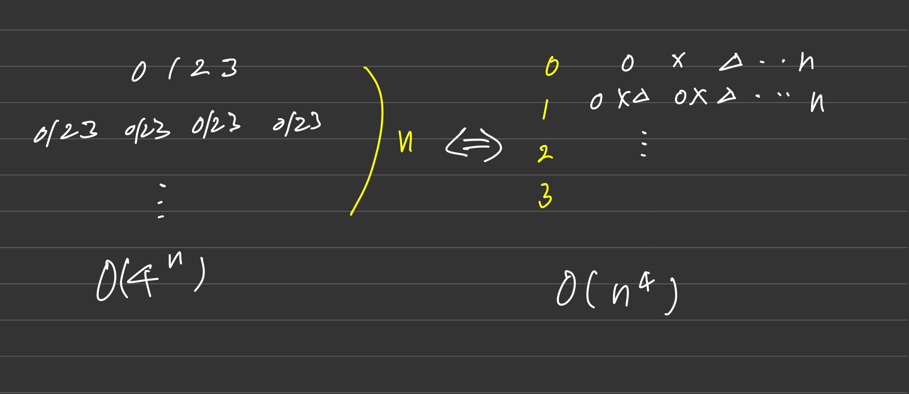

### 완전 탐색의 경우의 수를 고려하는 '상태트리'는 다음과 같이 대표적으로 두가지이다
+ 이들은 `상호 치환`이 가능한 경우가 있다

예를들어,
사용자가 누를 수 있는 버튼 0,1,2,3이 있다.

이 버튼을 눌러서 어떤 결과를 얻으면, 프로그램은 종료한다고 할 때 

### 왼쪽 트리
만약 어떤 결과를 얻을 수 없는 경우, 무한 호출에 빠짐으로 `답이 없는 경우`를 고려해야 하는데, 적정선을 찾기 쉽지 않다

### 오른쪽 트리
`각 버튼을 몇번 누르는가?`로 관점을 바꾸어 만들어낸 트리이다

이 경우, 최대 몇번 누를 수 있는지 혹은 `선택하는 가짓수의 기준을 세우거나 제시된 경우` 쓸 수 있다. ex) 부분 집합 : 각 원소를 선택 하거나 안하거나 2가지를 가진다

특정한 환경에서 사용되는 트리이지만, 트리의 길이가 고정되어있기 때문에 답이 없는 경우를 고려하기 쉽다(모든 트리 길이를 방문한 경우 종료하면 됨)

때문에, 답이 없는 경우에도 `무한 호출에 빠지지 않는다`

### 항상 상태트리의 치환 가능성을 고려하자
왼쪽으로 풀면 `답이 없는 경우` 외에도 여러 제약을 걸어야하는 경우가 많다.

때문에, `오른쪽 트리로 치환 가능한지 최대한 고려`해보아야한다 (비교적 `오른쪽 트리가 구현 및 디버깅이 쉬움`)

### 시계 맞추기 문제가 대표적인 치환 가능성을 고려한 케이스이다