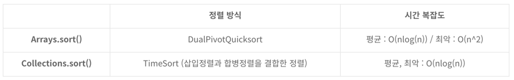

### 배열과 컬랙션 정렬에 쓰이는 알고리즘이 다른 이유? 
둘다  `평균 nlogn`이긴 함.

Array는 메모리적으로 각 값들이 `연속적인 주소`를 가지고 있기 때문에 C의 값이 낮습니다. 그래서 참조 지역성이 좋은 퀵 정렬을 이용하면 충분한 성능을 제공할 수 있다고 합니다. 

하지만 Collection은 List를 기준으로 봤을때 메모리간 인접한 ArrayList 뿐만 아니라 `메모리적으로 산발적`인 LinkedList도 함께 존재합니다. 따라서 참조 인접성이 좋지 않고 C의 값이 상대적으로 높다고 합니다. 

이럴 때는 퀵 정렬 보다는 합병정렬과 삽입정렬을 병합한 Tim 정렬을 이용하는게 평균적으로 더 좋은 성능을 기대할 수 있다고합니다.

* Collection은 메모리가 LinkedList처럼 산발적인 경우가 있어서 구간 정렬이 없는 것임

