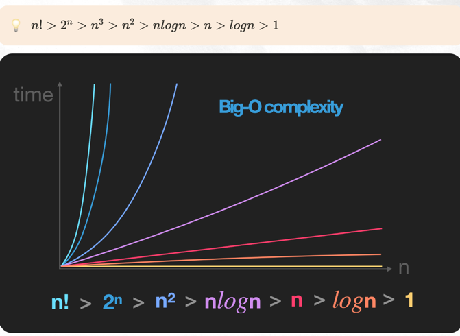
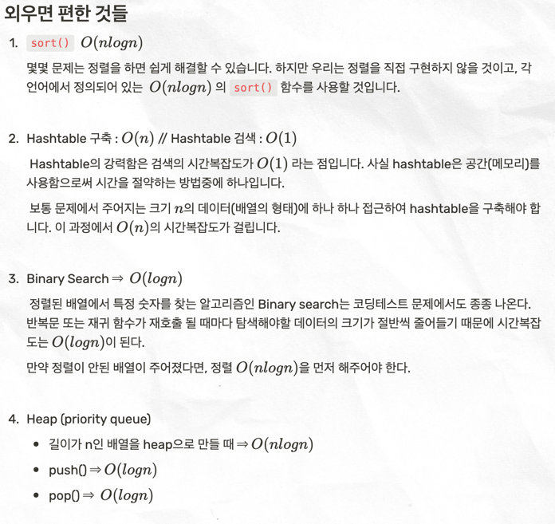

### 좋은 코드란 다음을 모두 만족하는 코드이다

**시간 복잡도 :** 데이터 량, 환경에 따라 변할 수 있는 수행 시간의 경향성 (BIG-O)

**공간 복잡도 :** 코드의 메모리 사용도 `(메모리를 사용해 시간 복잡도를 낮출 수 있다. ex) 해쉬테이블)`

**구현 복잡도 :** 가독성과 클린코드 등 유지보수성을 만족하는 정도

### 반드시, 코드를 짠 후 시간 복잡도를 고려해라!

 

### 시간복잡도 최고 차항 (*필수 암기)

+ `2^n :` 은 두 번 호출하는 재귀 코드  ex) 피보나치

+ `logN :` 한번 돌때마다 데이터가 절반으로 줄어드는 코드 ex) 이진탐색

+ `정렬`, `해쉬`, `이진탐색`, `힙` 라이브러리의 시간복잡도는 외워두자

 

### 다른 자료구조 적용을 고민해야하는 경우

제약조건을 고려했을 때, 시간복잡도가 `1억을 넘는다면 다른 방식을 고려`해야한다

완전탐색시 1억이 넘음 ->  정렬을 고려해볼까? -> 해쉬를 고려해볼까?
